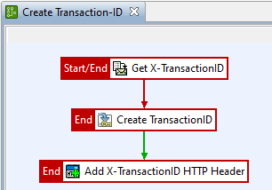

# Transaction-ID Policy

## Overview 

This policy `API Manager Policies/Create Transaction-ID` can be used to generate a transaction ID across multiple API requests that belong to the same logical transaction. The policy extracts the HTTP header: `X-TransactionID` in the first step and if it is not set, a new transaction ID is generated. This is finally added as a new HTTP header.  



In order for a transaction to be recognized across multiple requests, the generated transaction ID must of course be sent again in the same header in subsequent requests.

## Setup 

1. Import the Policy-Fragment

Import the [policy fragment](TransactionPolicy.xml) into your group policy configuration. It has version 7.7.0 and with that it can be imported in any later release. You will get the following new policy: `API Manager Policies/Create Transaction-ID`

2. Register as Global-Request Policy

Register this policy as a global request policy for the API Manager and enable it in the [API Manager UI](https://docs.axway.com/bundle/axway-open-docs/page/docs/apim_administration/apimgr_admin/api_mgmt_custom_policies/index.html#enforce-api-manager-global-policies).  


Alternatively, you can of course include this policy as a policy callback in an existing policy or include it in your policies exposed directly by the API-Gateway.

3. Export Transaction-ID

As a final step, export the generated transaction ID to the event logs. This allows you to integrate them into 3rd party systems.  


The Transaction-ID will become part of the Event-File:
```json
{
  "type": "transaction",
  "time": 1613426684268,
  "path": "/api/emr/diagnostic",
  "protocol": "https",
  "protocolSrc": "8065",
  "duration": 69,
  "status": "success",
  "serviceContexts": [
    {
    ...
    }
  ],
  "customMsgAtts": {
    "transactionId": "0304658874022716452437861102867924833543"
  },
  "correlationId": "fcef2a6002c28f824afb698c",
  "legs": [
    {
    ...
    }
  ]
}
```

## Reference / Development

The Javascript code used in the policy:
```javascript
var imp = new JavaImporter(java.util, java.math);
with(imp) {
	function invoke(msg) {
		// Transaction-ID must be numeric
		var transactionId = java.lang.String.format("%040d", new BigInteger(UUID.randomUUID().toString().replaceAll("-", ""), 16) );
		msg.put("transactionId", transactionId);
		return true;
	}
};
```
